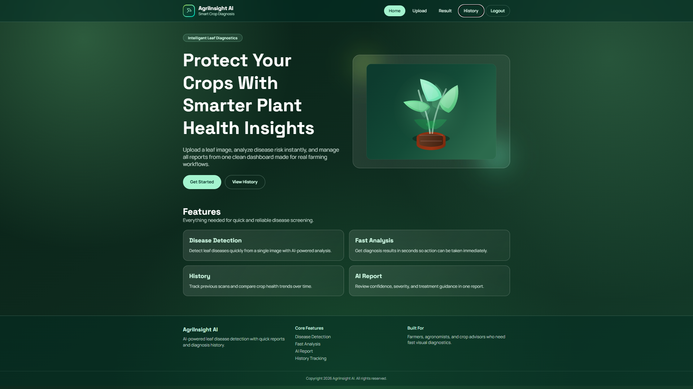
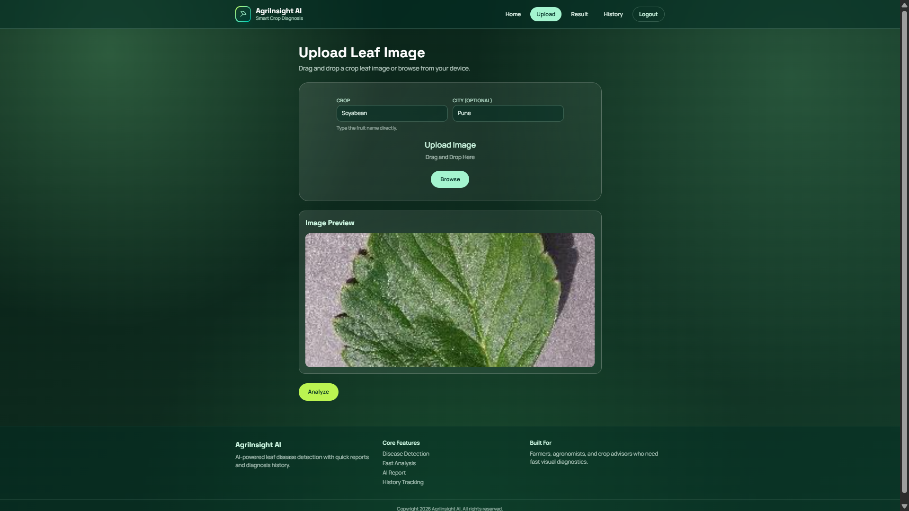
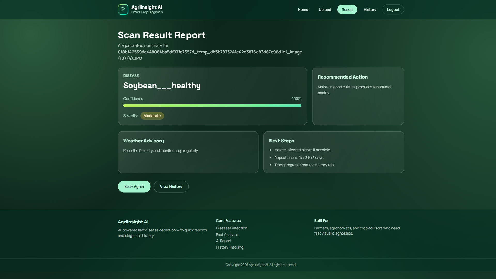
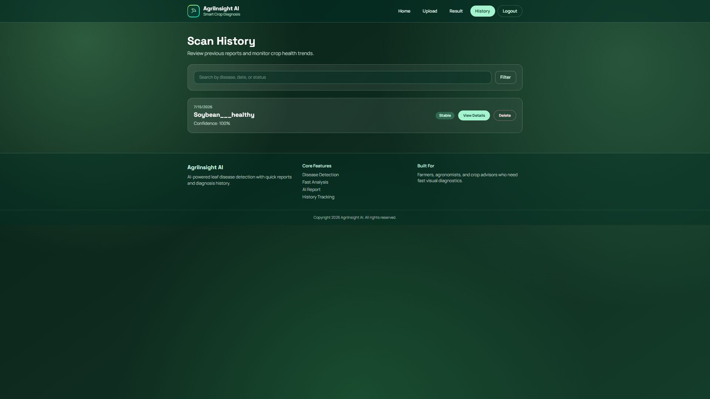

# 🌾 AgriInsight AI
### AI-Powered Smart Crop Disease Detection & Agricultural Recommendation System

<p align="center">


</p>

---

# 📖 About the Project

**AgriInsight AI** is an AI-powered web application that helps farmers identify plant diseases by simply uploading an image of a crop leaf.

The system uses a **Deep Learning (TensorFlow/Keras)** model trained on plant disease datasets to predict the disease and provides:

- 🌿 Disease Name
- 🎯 Prediction Confidence
- 💊 Treatment Suggestions
- 🌦️ Weather-based Recommendations
- 🚜 Farming Guidance

The project combines **Artificial Intelligence**, **Computer Vision**, and **Modern Web Technologies** to make crop disease diagnosis fast, simple, and accessible.

---

# ✨ Features

✅ Upload Crop Leaf Images

✅ AI-Based Disease Detection

✅ Deep Learning Prediction Model

✅ Confidence Score

✅ Disease Description

✅ Treatment Recommendations

✅ Weather Suggestions

✅ Responsive React Frontend

✅ Flask REST API Backend

---

# 🖥️ Tech Stack

## Frontend

- React.js
- Vite
- HTML5
- CSS3
- JavaScript
- Axios

---

## Backend

- Flask
- Flask-CORS
- TensorFlow / Keras
- NumPy
- Pillow (PIL)

---

## AI Model

- TensorFlow
- Keras
- CNN (Convolutional Neural Network)

---

# 📂 Project Structure

```
AgriInsight_AI/
│
├── backend/
│   ├── app.py
│   ├── models/
│   ├── uploads/
│   ├── requirements.txt
│   └── ...
│
├── frontend/
│   ├── src/
│   ├── public/
│   ├── package.json
│   └── ...
│
├── README.md
└── .gitignore
```

---

# 🚀 Installation

## 1️⃣ Clone Repository

```bash
git clone https://github.com/prachi-ankush-3/AgriInsight_AI-.git

cd AgriInsight_AI
```

---

## 2️⃣ Model Setup

Create a **models** folder inside the **backend** directory and place the downloaded trained model file inside it.

Project structure:

```text
AgriInsight_AI/
│
├── backend/
│   ├── app.py
│   ├── requirements.txt
│   ├── models/
│   │   └── plant_disease_recog_model_pwp.keras
│   └── ...
└── frontend/
```

> 📥 Download the trained model from the Google Drive link provided above and place it inside the `backend/models/` folder.

---

## 3️⃣ Backend Setup

```bash
cd backend

pip install -r requirements.txt

python app.py
```

Backend runs at:

```text
http://localhost:5000
```

---

## 3️⃣ Frontend Setup

```bash
cd frontend

npm install

npm run dev
```

Frontend runs at:

```
http://localhost:5173
```

---

# 📸 Application Screenshots

## 🏠 Home Page

<p align="center">
  
</p>

---

## 📤 Image Upload

<p align="center">
  
</p>

---

## 🤖 Disease Prediction

<p align="center">
  
</p>

---

## 📊 Prediction History

<p align="center">
  
</p>


=======


---

# 🔍 Working Flow

```
User Uploads Leaf Image
            │
            ▼
React Frontend
            │
            ▼
Flask Backend API
            │
            ▼
TensorFlow AI Model
            │
            ▼
Disease Prediction
            │
            ▼
Confidence Score
            │
            ▼
Treatment Recommendation
            │
            ▼
Display Result
```

---

# 🌱 Supported Plant Diseases

Example diseases supported by the model:

- Apple Scab
- Apple Black Rot
- Corn Rust
- Corn Leaf Blight
- Potato Early Blight
- Potato Late Blight
- Tomato Early Blight
- Tomato Late Blight
- Tomato Mosaic Virus
- Tomato Yellow Leaf Curl Virus
- Pepper Bell Bacterial Spot
- Healthy Leaves

*(Depends on the trained model.)*

---

# 📊 Model Information

| Model | CNN (TensorFlow/Keras) |
|---------|------------------------|
| Framework | TensorFlow |
| Language | Python |
| Input | Leaf Image |
| Output | Disease Prediction |
| Task | Image Classification |

---

# 📁 Dataset

Dataset used for training the model:

🔗 TensorFlow Plant Disease Dataset

https://www.tensorflow.org/datasets/catalog/plant_village

You can also train the model using the PlantVillage dataset available on Kaggle.

---

# 📓 Model Training Notebook

**Google Colab Notebook:**  
https://colab.research.google.com/drive/1M60m6lwKBTm5QwZVlnmYic2h7s93NNbc?usp=sharing

# 🧠 Trained Model

**Google Drive (Trained Model):**  
https://drive.google.com/file/d/1jw8Bop9qguB35rc1D9UQ56WeObj3WiM5/view?usp=sharing


---

# 📦 API Endpoint

### Predict Disease

```
POST /predict
```

Upload:

```
multipart/form-data
```

Parameter:

```
file : Image
```

Response:

```json
{
  "prediction": "Tomato Early Blight",
  "confidence": 98.45,
  "treatment": "Use recommended fungicide and remove infected leaves."
}
```

---

# 🔮 Future Enhancements

- 🌍 Live Weather API
- 📍 Location-Based Recommendations
- 🌾 Fertilizer Recommendation
- 🌱 Soil Analysis
- 📱 Android Application
- 🔊 Voice Assistant (Regional Languages)
- 🌐 Multi-Language Support
- 📊 Farmer Dashboard

---


# 📜 Requirements

Backend dependencies:

```
Flask
Flask-CORS
tensorflow
numpy
pillow
```

Frontend dependencies:

```
React
Vite
```

---

# 🤝 Contributing

Contributions are welcome!

1. Fork the repository
2. Create a new branch
3. Commit your changes
4. Push the branch
5. Create a Pull Request

---

# ⭐ Support

If you found this project helpful,

⭐ Star this repository

🍴 Fork it

📢 Share it with others


---

## ❤️ Made with AI for Smarter Agriculture
